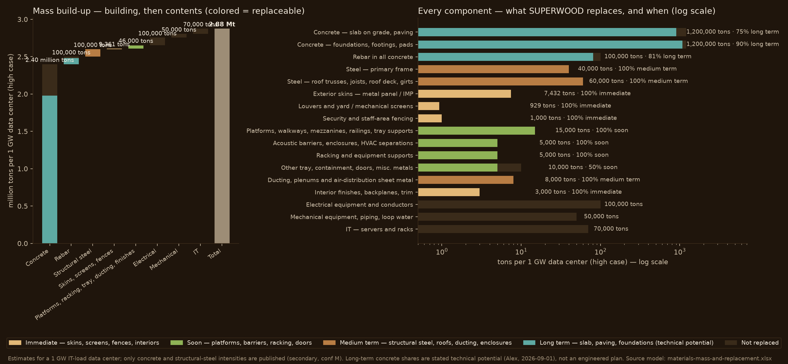

# Material mass in a data center — the build-up, and how much SUPERWOOD can replace

Date: 2026-09-05 (v7: server and equipment enclosures removed from the long-term horizon — IT is never replaced (Alex 2026-09-05); v6: per-component embodied carbon, steel and concrete carbon shares, EAF sensitivity and a steel-share-of-above-ground-mass sheet added to the workbook; v5: racking stays *Soon* — a few months of development; server and equipment enclosures, 40% of IT mass, added to the *Long term*; electronics never — per Alex 2026-09-04. v4 2026-09-01 set the long-term concrete shares). Status: **estimate**.
Every table below is generated from the live model [materials-mass-and-replacement.xlsx](materials-mass-and-replacement.xlsx)
— change an input there and regenerate rather than hand-edit. Labels: published / derived / estimated; confidence
`[conf: H|M|L]`. Treat everything as `[conf: L]` unless marked.

Reference unit: **1 GW of IT load** — a data center of roughly 5–10 hyperscale buildings on the assumptions below.
Low and high columns are whole scenarios (all-low inputs, all-high inputs), not a distribution.

## The four horizons

| Horizon | What it means | Product and plant | Gate |
|---|---|---|---|
| **Immediate** | Replacements shipping now | SuperMill One boards to 8" × 16' × 3/8" | None beyond E84 Class A where a finish rating applies |
| **Soon** | Non-structural items behind one scoped test program — racks, platforms, barriers, doors | SuperMill One, then SuperMill Two | A scoped test program per application; racks are a few months of development |
| **Medium term** | Structural steel (primary and roof), roof trusses and roofs, ducting, enclosures | SuperMill Two boards and veneers | Mass-timber qualification pathway, ICC-ES, E119, NFPA 285, FM acceptance; NFPA 90A / UL 181 for ducting |
| **Long term** | Concrete: 75% of slab-on-grade and paving, 90% of foundations, footings, piers and pads, with the rebar in each — never the electronics | ChipMill-scale products | Stated technical potential (Alex, 2026-09-01 and 2026-09-04); no design or code pathway yet |

## 1. Assumptions that drive the build-up

| Item | Low | High | Label |
|---|---|---|---|
| Building area per MW | 5,000 sf | 10,000 sf | estimated |
| Buildings per GW (1M sf footprint each) | 5 | 10 | derived |
| Exterior wall area (4 × 1,000 ft × 40 ft per building) | 0.8M sf | 1.6M sf | derived |
| Perimeter walls | metal panel / IMP (switch to precast in the model) | | choice |
| Concrete intensity, all concrete | 500 m³/MW | 1,000 m³/MW | published, secondary [M] — arXiv 2509.21312 citing Hasan 2022 / Sharma 2023 |
| Share of concrete in foundations, footings, piers, pads | 40% | 50% | estimated |
| Structural steel intensity | 50 t/MW | 100 t/MW | same source [M] |
| Roof-and-secondary share of structural steel (trusses, joists, deck, girts) | 40% | 60% | estimated |
| Rebar | 60 kg/m³ | 100 kg/m³ | estimated |
| Ducting and air-distribution sheet metal | 3 t/MW | 8 t/MW | estimated |
| Electrical / mechanical / IT | 50 / 20 / 15 t/MW | 100 / 50 / 70 t/MW | estimated from unit masses; GB200 NVL72 rack 1.36 t [H] |
| SUPERWOOD board | 7.2 mm × 1.3 t/m³ = 0.87 kg/sf; SuperMill One ≈ 900 tons/yr, SuperMill Two ≈ 31,000 tons/yr | | internal TEM basis |
| Substitution, steel | 0.3 kg SUPERWOOD per kg steel | 0.6 kg/kg | estimated — to be engineering-stamped per element |
| Long-term technical potential, concrete | 75% of slab and paving; 90% of foundations, footings, piers, pads | same | asserted-internal (Alex, 2026-09-01) |
| Substitution, concrete | 0.05 kg SUPERWOOD per kg concrete | 0.15 kg/kg | estimated — lightweight insulated wood-foundation concept, no design exists |

## 2. The build-up: what goes into a 1 GW data center

Read top to bottom. Building structure and envelope first, then contents. The cumulative column is the running total.

### 2a. Building — structure and envelope

| Component | Mass per data center | Cumulative |
|---|---|---|
| Concrete: slab on grade, paving, yard | 720,000–1,200,000 tons | 720,000–1,200,000 tons |
| Concrete: foundations, footings, piers, equipment pads | 480,000–1,200,000 tons | 1,200,000–2,400,000 tons |
| Precast / tilt-up perimeter walls (precast case) | — | 1,200,000–2,400,000 tons |
| Rebar in all concrete | 30,000–100,000 tons | 1,230,000–2,500,000 tons |
| Structural steel — primary frame (columns, girders) | 30,000–40,000 tons | 1,260,000–2,540,000 tons |
| Structural steel — roof trusses, joists, roof deck, girts | 20,000–60,000 tons | 1,280,000–2,600,000 tons |
| Exterior skins — metal panel / IMP (metal-panel case) | 1,858–7,432 tons | 1,281,858–2,607,432 tons |
| Louvers and yard / mechanical screens | 186–929 tons | 1,282,044–2,608,361 tons |
| Security and staff-area fencing | 300–1,000 tons | 1,282,344–2,609,361 tons |

### 2b. Contents — fit-out and equipment

| Component | Mass per data center | Cumulative |
|---|---|---|
| Platforms, walkways, mezzanines, railings, tray supports | 5,000–15,000 tons | 1,287,344–2,624,361 tons |
| Acoustic barriers, enclosures, HVAC separations | 2,000–5,000 tons | 1,289,344–2,629,361 tons |
| Racking and equipment supports | 2,000–5,000 tons | 1,291,344–2,634,361 tons |
| Other tray, containment, doors, misc. metals | 5,000–10,000 tons | 1,296,344–2,644,361 tons |
| Ducting, plenums and air-distribution sheet metal | 3,000–8,000 tons | 1,299,344–2,652,361 tons |
| Interior finishes, backplanes, trim (admin / office) | 1,000–3,000 tons | 1,300,344–2,655,361 tons |
| Electrical equipment and conductors | 50,000–100,000 tons | 1,350,344–2,755,361 tons |
| Mechanical equipment, piping, loop water | 20,000–50,000 tons | 1,370,344–2,805,361 tons |
| IT — servers and racks | 15,000–70,000 tons | 1,385,344–2,875,361 tons |

**Total mass, building and contents: 1,385,344–2,875,361 tons** (about 1.4–2.9 Mt).
**Excluding concrete: 185,344–475,361 tons** — concrete is 83–87% of everything by mass.

Two consequences follow before any SUPERWOOD arithmetic:

- Any "share of a data center" statement must say whether concrete is in the denominator.
- Excluding concrete, steel in all forms (structural, rebar, roughly 60% of equipment mass as enclosures and cores,
  racks, tray, ducting) comes out near 70% of what is left on these assumptions — consistent in order of magnitude
  with the company's ex-concrete "~60% steel" framing, but a derivation, not a source.

## 3. How much of it SUPERWOOD can replace — component by component

Same rows as Section 2, with the share of each component SUPERWOOD can address in each horizon (a row may split across
horizons; these are the editable columns on the workbook sheet *1 GW data center*), the incumbent mass replaced, and
the SUPERWOOD mass required.

### 3a. Building — structure and envelope

| Component | Immediate | Soon | Medium term | Long term | Incumbent replaced | SUPERWOOD required | Gate / basis |
|---|---|---|---|---|---|---|---|
| Concrete: slab on grade, paving, yard | — | — | — | 75% | 540,000–900,000 tons | 27,000–135,000 tons | Technical potential per Alex (75%); no design or code pathway yet. arXiv 2509.21312 [M] for total concrete |
| Concrete: foundations, footings, piers, equipment pads | — | — | — | 90% | 432,000–1,080,000 tons | 21,600–162,000 tons | Technical potential per Alex (90%); lightweight insulated SUPERWOOD foundations — geotechnical, durability and code pathway all open |
| Precast / tilt-up perimeter walls (precast case) | — | — | 100% | — | — | — | Hybrid SUPERWOOD wall panels; NFPA 285 + E119 assemblies. Active when Inputs walls_precast = 1 |
| Rebar in all concrete | — | — | — | 81% | 24,300–81,000 tons | 7,290–48,600 tons | Rebar follows the concrete it sits in: foundation share × 90% + slab share × 75% |
| Structural steel — primary frame (columns, girders) | — | — | 100% | — | 30,000–40,000 tons | 9,000–24,000 tons | ICC-ES via the mass-timber qualification pathway; FM acceptance; E119 |
| Structural steel — roof trusses, joists, roof deck, girts | — | — | 100% | — | 20,000–60,000 tons | 6,000–36,000 tons | Design values and connection data; trusses carry no fire-resistance requirement |
| Exterior skins — metal panel / IMP (metal-panel case) | 100% | — | — | — | 1,858–7,432 tons | 696–1,391 tons | Shipping now; area-for-area rain screen |
| Louvers and yard / mechanical screens | 100% | — | — | — | 186–929 tons | 174–435 tons | Shipping now |
| Security and staff-area fencing | 100% | — | — | — | 300–1,000 tons | 234–468 tons | Shipping now — the Microsoft near-term list |

### 3b. Contents — fit-out and equipment

| Component | Immediate | Soon | Medium term | Long term | Incumbent replaced | SUPERWOOD required | Gate / basis |
|---|---|---|---|---|---|---|---|
| Platforms, walkways, mezzanines, railings, tray supports | — | 100% | — | — | 5,000–15,000 tons | 1,500–9,000 tons | Published design values; IBC 1607 for railings |
| Acoustic barriers, enclosures, HVAC separations | — | 100% | — | — | 2,000–5,000 tons | 600–3,000 tons | STC / OITC lab and field data |
| Racking and equipment supports | — | 100% | — | — | 2,000–5,000 tons | 600–3,000 tons | A few months of design and load-data development (Alex 2026-09-04) |
| Other tray, containment, doors, misc. metals | — | 50% | — | — | 2,500–5,000 tons | 750–3,000 tons | Partial; UL 10C for rated doors |
| Ducting, plenums and air-distribution sheet metal | — | — | 100% | — | 3,000–8,000 tons | 900–4,800 tons | NFPA 90A / UL 181 noncombustibility expectations for in-airstream components — the hardest gate in this row set |
| Interior finishes, backplanes, trim (admin / office) | 100% | — | — | — | 1,000–3,000 tons | 130–391 tons | E84 Class A finish; backplanes UL 94 yellow card (not yet started) |
| Electrical equipment and conductors | — | — | — | — | — | — | Gensets, transformers, switchgear, batteries, copper |
| Mechanical equipment, piping, loop water | — | — | — | — | — | — | Chillers, fan walls, coolers, piping (ductwork is its own row) |
| IT — servers and racks | — | — | — | — | — | — | Servers, racks as shipped, and their enclosures are not replaced (Alex 2026-09-05; server boxes removed from the long-term horizon). Rack masses [H]; aggregate per MW [L] |

## 4. Roll-up by horizon (per 1 GW data center)

| Horizon | Incumbent mass replaced | SUPERWOOD required | Plant-years |
|---|---|---|---|
| Immediate — skins, screens, fences, interiors, backplanes | 3,344–12,361 tons | 1,234–2,685 tons (1.4–3.1M sf) | 1.4–3.1 yr of SuperMill One |
| Soon — platforms, railings, barriers, racking, doors | 11,500–30,000 tons | 3,450–18,000 tons | 0.1–0.6 yr of SuperMill Two |
| Medium term — structural steel, roof trusses and roofs, ducting, enclosures | 53,000–108,000 tons | 15,900–64,800 tons | 0.5–2.1 yr of SuperMill Two |
| Long term — slab, paving, foundations and their rebar (technical potential) | 996,300–2,061,000 tons | 55,890–345,600 tons | 1.8–11.0 yr of SuperMill Two |
| **Cumulative** | **1,064,144–2,211,361 tons** | **76,474–431,085 tons** | **2.4–13.8 yr of SuperMill Two** |
| Not replaced by SUPERWOOD | 321,200–664,000 tons | | about 23% of total mass |

- Through the medium term SUPERWOOD addresses **67,844–150,361 tons** of incumbent
  material — essentially all the steel above the slab, about
  4.9–5.2% of total data center mass.
  The long-term concrete rows are what move the total: with them, the ceiling is **76.8–76.9% of total
  data center mass**. Those shares (75% of slab and paving, 90% of foundations) are stated technical potential, not an
  engineered plan, and the whole difference between the two figures rests on them.
- What stays: the remaining concrete, servers, gensets, transformers, switchgear, batteries, chillers, copper, loop
  water — about 23% of total mass.
- Plant math: one gigawatt data center's immediate skins are 1.4–3.1M sf, **1.4–3.1 years
  of SuperMill One's entire output**. The medium-term structural horizon alone is 0.5–2.1 years of SuperMill
  Two per gigawatt — two or three gigawatts of data center absorb the plant for years, which is the offtake argument and
  the capacity risk in one number. The long-term concrete rows, if they ever became real, are a ChipMill-scale market on their own.

## 5. Embodied-carbon effect (pre-LCA, per GW)

Deck figures: steel 1.8 kg CO₂e/kg (global BF-BOF average), concrete 0.12 kg/kg, SUPERWOOD 0.5 kg/kg manufactured and
1.3 kg/kg biogenic carbon stored — **pre-LCA projections at scale; LCA under way with Prof. Ming Hu, University of Notre
Dame.** Biogenic storage reported separately (EN 15804 module C). Each component is valued at its own factor: concrete
rows at 0.12, steel rows (including rebar) at 1.8, interior finishes at 1.0 [estimate]; equipment rows, including the
IT equipment carry no factor, so long-term avoided emissions count concrete and rebar only. The "vs EAF" column revalues steel at 0.7 kg/kg (recycled, high end).

| Horizon | Incumbent emissions avoided | SUPERWOOD manufacturing | Net reduction | Net vs EAF steel | Biogenic stored (separate) |
|---|---|---|---|---|---|
| Immediate (steel) | 5,219–19,850 tons CO₂e | 617–1,343 tons | **4,602–18,508 tons** | 2,024–8,210 tons | 1,604–3,491 tons |
| Soon (steel) | 20,700–54,000 tons CO₂e | 1,725–9,000 tons | **18,975–45,000 tons** | 6,325–12,000 tons | 4,485–23,400 tons |
| Medium term (steel) | 95,400–194,400 tons CO₂e | 7,950–32,400 tons | **87,450–162,000 tons** | 29,150–43,200 tons | 20,670–84,240 tons |
| Long term (foundation concrete) | 160,380–383,400 tons CO₂e | 27,945–172,800 tons | **132,435–210,600 tons** | 105,705–121,500 tons | 72,657–449,280 tons |

Against recycled (EAF) steel the avoided figure is far lower, so any claim must state its baseline.

### 5b. Embodied carbon by component (building materials; equipment not estimated)

The slide-5 "by embodied carbon" view. Factors: concrete 0.12 kg CO₂e/kg [M], steel 1.8 [M, global
BF-BOF average], interior finishes 1.0 [L]. Equipment (electrical, mechanical, IT) is outside a materials estimate.

| Component | Class | Factor kg CO₂e/kg | Embodied carbon, low–high |
|---|---|---|---|
| Concrete: slab on grade, paving, yard | concrete | 0.12 | 86,400–144,000 tons CO₂e |
| Concrete: foundations, footings, piers, equipment pads | concrete | 0.12 | 57,600–144,000 tons CO₂e |
| Precast / tilt-up perimeter walls (precast case) | concrete | 0.12 | — |
| Rebar in all concrete | steel | 1.8 | 54,000–180,000 tons CO₂e |
| Structural steel — primary frame (columns, girders) | steel | 1.8 | 54,000–72,000 tons CO₂e |
| Structural steel — roof trusses, joists, roof deck, girts | steel | 1.8 | 36,000–108,000 tons CO₂e |
| Exterior skins — metal panel / IMP (metal-panel case) | steel | 1.8 | 3,345–13,378 tons CO₂e |
| Louvers and yard / mechanical screens | steel | 1.8 | 334–1,672 tons CO₂e |
| Security and staff-area fencing | steel | 1.8 | 540–1,800 tons CO₂e |
| Platforms, walkways, mezzanines, railings, tray supports | steel | 1.8 | 9,000–27,000 tons CO₂e |
| Acoustic barriers, enclosures, HVAC separations | steel | 1.8 | 3,600–9,000 tons CO₂e |
| Racking and equipment supports | steel | 1.8 | 3,600–9,000 tons CO₂e |
| Other tray, containment, doors, misc. metals | steel | 1.8 | 9,000–18,000 tons CO₂e |
| Ducting, plenums and air-distribution sheet metal | steel | 1.8 | 5,400–14,400 tons CO₂e |
| Interior finishes, backplanes, trim (admin / office) | mixed | 1 | 1,000–3,000 tons CO₂e |
| Electrical equipment and conductors | equipment | — | not estimated |
| Mechanical equipment, piping, loop water | equipment | — | not estimated |
| IT — servers and racks | equipment | — | not estimated |

| Roll-up | Low | High |
|---|---|---|
| Embodied carbon, building materials | 323,819 tons CO₂e | 745,250 tons CO₂e |
| Steel share | 55% | 61% |
| Concrete share | 44% | 39% |
| Steel above the slab (steel excl. rebar), share | 39% | 37% |
| Steel share if steel is recycled (EAF, 0.7 kg/kg) | 32% | 38% |

By embodied carbon, steel is roughly 55–60% of the building materials and concrete roughly 40–45% at the global-average
steel factor; with recycled steel the steel share falls to about a third. The steel above the slab — what SUPERWOOD
addresses through the structural horizon — carries about 37% of the building materials' embodied carbon.

### 5c. Steel share of above-ground mass, contents included (workbook sheet *Steel share*)

Basis for the slide-5 headline. Excludes slab, paving, foundations and all concrete. Steel fractions per component
are estimates [conf: L] and editable in the workbook. Printed band on the deck: **50–80%** (Alex, 2026-09-04).

| Component | Mass, low–high | Steel fraction | Steel, low–high | Basis |
|---|---|---|---|---|
| Precast / tilt-up perimeter walls (precast case) | — | 3%–5% | — | rebar in precast/tilt-up panels; row is zero unless Inputs walls_precast = 1 |
| Structural steel — primary frame (columns, girders) | 30,000–40,000 tons | 100%–100% | 30,000–40,000 tons | steel by definition |
| Structural steel — roof trusses, joists, roof deck, girts | 20,000–60,000 tons | 100%–100% | 20,000–60,000 tons | steel by definition |
| Exterior skins — metal panel / IMP (metal-panel case) | 1,858–7,432 tons | 85%–95% | 1,579–7,061 tons | steel-faced IMP; some aluminum |
| Louvers and yard / mechanical screens | 186–929 tons | 40%–70% | 74–650 tons | aluminum common |
| Security and staff-area fencing | 300–1,000 tons | 90%–100% | 270–1,000 tons | chain-link, palisade, posts |
| Platforms, walkways, mezzanines, railings, tray supports | 5,000–15,000 tons | 95%–100% | 4,750–15,000 tons | structural and misc. steel |
| Acoustic barriers, enclosures, HVAC separations | 2,000–5,000 tons | 70%–90% | 1,400–4,500 tons | steel panels with absorptive fill |
| Racking and equipment supports | 2,000–5,000 tons | 95%–100% | 1,900–5,000 tons | steel |
| Other tray, containment, doors, misc. metals | 5,000–10,000 tons | 85%–95% | 4,250–9,500 tons | mostly steel, some aluminum |
| Ducting, plenums and air-distribution sheet metal | 3,000–8,000 tons | 95%–100% | 2,850–8,000 tons | galvanized steel |
| Interior finishes, backplanes, trim (admin / office) | 1,000–3,000 tons | 20%–40% | 200–1,200 tons | gypsum, wood, steel studs |
| Electrical equipment and conductors | 50,000–100,000 tons | 50%–65% | 25,000–65,000 tons | enclosures, cores, gensets, switchgear; rest copper, oil, batteries |
| Mechanical equipment, piping, loop water | 20,000–50,000 tons | 45%–65% | 9,000–32,500 tons | chillers, piping steel; water, copper, refrigerant not |
| IT — servers and racks | 15,000–70,000 tons | 40%–60% | 6,000–42,000 tons | steel chassis and racks; aluminum, PCBs, copper |
| **Above-ground total** | **155,344–375,361 tons** | | **107,274–291,411 tons** | |

| Share | Low | High |
|---|---|---|
| Steel share of above-ground mass (wall system per Inputs toggle) | 69% | 78% |
| — with metal-panel / IMP walls | 69% | 79% |
| — with tilt-up / precast concrete walls (35,675–71,350 tons of panel) | 56% | 66% |
| Including slab rebar (at-grade steel) | 74% | 82% |
| Structure and envelope only | 99% | 99% |

Equipment is 55–60% of above-ground mass, so the answer turns on how much of a genset, switchgear lineup, chiller and
server rack is steel; at 40% for all equipment the share falls to about 60–65%. The wall system is the other lever:
tilt-up or precast concrete walls add tens of thousands of tons of above-ground concrete and pull the share down by
about ten points, which is why the deck prints a 50–80% band rather than a point. Narrative: [steel-share-above-ground.md](steel-share-above-ground.md).

## 6. Sensitivities — what moves the answer most

1. **Long-term concrete.** The long-term rows are 996,300–2,061,000 tons of concrete and rebar on stated technical
   potential (75% of slab and paving, 90% of foundations) and a 0.05–0.15 substitution factor, none of it engineered.
   They are the only rows that change the total-mass share materially, and the least evidenced. Present them as
   technical potential and say so on the slide.
2. **Precast vs metal-panel walls.** Decides whether facades are a 1,858–7,432 tons metal replacement now or a
   concrete-panel replacement in the medium term behind NFPA 285 and E119.
3. **Structural steel intensity.** The 50–100 t/MW range is a factor of two; one real takeoff from HITT, Turner or
   Fast + Epp collapses it.
4. **Substitution factor.** 0.3–0.6 kg per kg is the whole medium-term SUPERWOOD demand number; Fast + Epp can stamp
   it per element.
5. **Ducting.** In-airstream components face NFPA 90A / UL 181 noncombustibility expectations; the July reviewers
   flagged this as the hardest sell in the set. Enclosures and separations are the safer framing.
6. **AI halls.** Higher rack density means fewer buildings per GW, less structure and skin per MW, more electrical and
   mechanical mass; the replaceable share falls.

## 7. Gaps and next steps

- One building's material takeoff (structure, envelope, foundations, fencing) from a construction partner.
- Read Hasan et al. 2022 and Sharma et al. 2023 directly; the arXiv preprint is a secondary citation.
- Fix the TEM thickness mix so plant output in tonnes is one number.
- Fast + Epp to state substitution factors for two or three elements (truss, joist, wall panel), and a first opinion
  on whether a SUPERWOOD foundation system is even a sensible engineering target.
- Confirm with Microsoft and Meta whether their standard design uses precast or metal-panel walls.

## Sources

- arXiv 2509.21312 (Sep 2025), citing Hasan et al. 2022 and Sharma et al. 2023 — structural steel 500–1,000 t and
  concrete 5,000–10,000 m³ per 10 MW [secondary, conf: M].
- NVIDIA GB200 NVL72 rack mass ~1,360 kg — NVIDIA published specification [conf: H].
- Internal: SUPERWOOD Structural and Cladding TEMs (Jan 2026); 7.2 mm average thickness basis
  (`../../investor-overview/sources/notes/superwood-unit-economics.md`).
- Internal: carbon figures per the Canva DCII deck (0.5 / −1.3 kg CO₂e per kg SUPERWOOD; steel 1.8), pre-LCA.
  Concrete 0.12 kg CO₂e/kg is a typical ready-mix cradle-to-gate value [conf: M].
- Unit masses for gensets, UPS, transformers, chillers, metal panel, fencing, ducting, rebar ratios, foundation share:
  general industry ranges, not individually sourced [conf: L]. Replace with vendor or takeoff data before external use.
